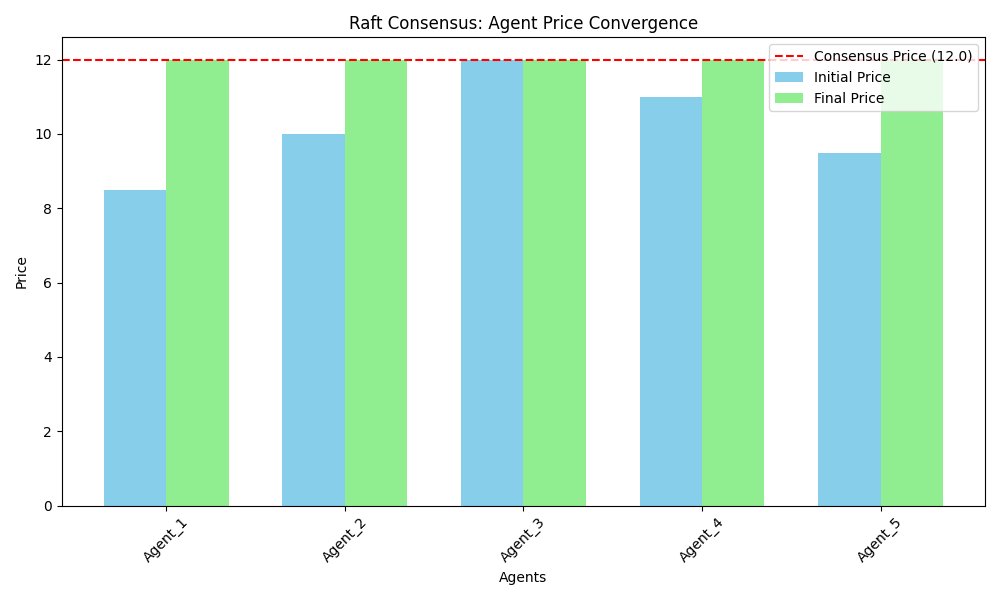

# Raft Style Consensus Implementation (Fork Modification)

I imlemented a raft-style algorithm to overcome the distributed consensus on a fair market price. Each agent proposes a price, and through leader election and majority voting among the agents, a consensus price is determined. 


---

##  Raft-Style algorithm implementation structure

The key components added or modified to implement the Raft-style consensus are:

1. **`market_sim/blockchain/raft.py`**  
   Implemented raft logic here.

2. **`market_sim/market/dynamics/price_consensus.py`**  
   Added price decision logic based on Raft here (calls raft module).

3. **`market_sim/market/agents/raft_agent.py`**  
   Agents initlisation with price proposals and price logs.

4. **`market_sim/simulation/scenarios/raft_simulation.py`**  
   Runs the full raft consensus scenario.

5. **`market_sim/tests/integration/test_raft_consensus.py`**  
   Validates correctness of consensus.

6. **`market_sim/analysis/visualisation/visualise_raft_results.py`**  
   Generates a bar chart to visulise the consensus results.
---

##  Bar chart visualization

##  Usage

runs the tests
```
pytest tests/integration/test_raft_consensus.py
```

runs the simulations and create visualtion chart
```
python -m market_sim.simulation.scenarios.raft_simulation
```

# Investment (Original Project Description)

Code related to the investment section of the website.

See [market_sim](market_sim/README.md) for more details on the market simulation framework

## Usage

```
python3 test_db_operations.py
```

## Market Dynamics and Trading Simulation

Implements a framework for simulating, analyzing, and learning about financial markets, trading strategies, and blockchain integration.

Currently v0.

## License

This project is licensed under the MIT License - see the [LICENSE](LICENSE) file for details.

The MIT License was chosen to:
- Encourage wide adoption and collaboration
- Allow commercial and academic use
- Keep compliance simple
- Protect contributors from liability
- Maintain compatibility with most open-source projects

## Notes

Project log reinitialized on 2025-01-19.
